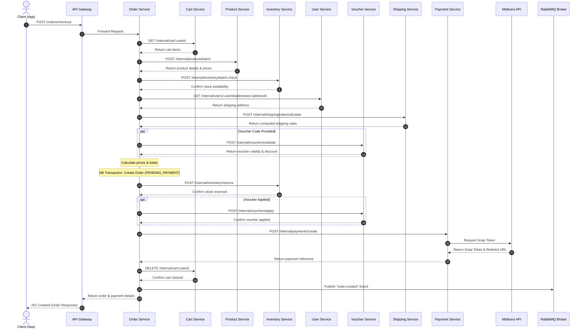

# Checkout Orchestration Flow

This document describes the end-to-end checkout orchestration process in NexaCommerce.

## 1. Step-by-Step Checkout Flow

The checkout process is orchestrated by the **Order Service** acting as the coordinator in a SAGA-like transaction pattern:

1. **Client Request:** The customer triggers the checkout process by calling `POST /orders/checkout` with their target shipping address ID, courier code, and optionally a voucher code.
2. **Fetch Active Cart:** The Order Service makes an internal HTTP call to the **Cart Service** (`GET /internal/cart/:userId`) to retrieve the current active cart items.
3. **Validate Items Exist:** The Order Service verifies that the cart is not empty. If empty, the transaction terminates with a `400 Bad Request`.
4. **Fetch Product Metadata:** The Order Service makes an internal HTTP call to the **Product Service** (`POST /internal/products/batch`) to retrieve up-to-date descriptions, prices, weights, categories, and seller IDs for all products in the cart.
5. **Check Inventory Levels:** The Order Service calls the **Inventory Service** (`POST /internal/inventory/batch-check`) to confirm that all items are in stock.
6. **Fetch Recipient Address:** The Order Service calls the **User Service** (`GET /internal/users/:id/addresses/:id`) to validate the shipping address and retrieve recipient coordinates, city names, and zip codes.
7. **Calculate Shipping Rates:** The Order Service calls the **Shipping Service** (`POST /internal/shipping/rates/calculate`) to calculate the shipping cost based on the courier selected, total weight, origin city (seller's city), and destination city (customer's address).
8. **Validate Voucher (Optional):** If a voucher code is provided, the Order Service calls the **Voucher Service** (`POST /internal/vouchers/validate`) to verify voucher availability, discount values, minimum purchase restrictions, expiry times, and scope limitations.
9. **Calculate Prices:** The Order Service runs the price calculation formula to determine the item totals, voucher discounts, shipping fees, and final grand total.
10. **Database Transaction (Order Creation):** The Order Service starts a local database transaction to create the `Order` record (status: `PENDING_PAYMENT`) and its corresponding `OrderItem` records.
11. **Reserve Inventory:** The Order Service calls the **Inventory Service** (`POST /internal/inventory/reserve`) to shift the product stock from `availableStock` to `reservedStock`.
12. **Lock Voucher Usage:** If applicable, the Order Service calls the **Voucher Service** (`POST /internal/vouchers/apply`) to increment the voucher usage count and lock the voucher to this order.
13. **Generate Payment Token:** The Order Service calls the **Payment Service** (`POST /internal/payments/create`) which interacts with the **Midtrans API** to generate a QRIS Snap token and payment redirect URL.
14. **Clear Cart & Publish Event:** The Order Service clears the user's cart via Cart Service (`DELETE /internal/cart/:userId`), publishes the `OrderCreated` (`order.created`) event to **RabbitMQ**, and returns the order details and payment redirect URL to the client.

---

## 2. Sequence Diagram

---

## 3. Rollback (Compensating Transactions) Strategy

Because the checkout process spans multiple physical microservices, if any step fails during the checkout sequence, the Order Service initiates a series of compensating transactions (rollback) to ensure data consistency:

| Failure Point | Compensating Action | Coordinator |
|---|---|---|
| **Inventory Reservation fails** | Release any reserved stock for this order; cancel Order database record. | Order Service |
| **Voucher Application fails** | Call `POST /internal/inventory/release` to revert reserved stock; cancel Order. | Order Service |
| **Payment Token Generation fails** | Revert reserved stock; release voucher usage; set Order database record status to `CANCELLED`. | Order Service |
| **Timeout / Connection loss** | SAGA orchestrator tracks the transaction status. An auto-cancellation daemon scans for unpaid orders and automatically triggers stock release and voucher release. | Order Service / Cron Daemon |

---

## 4. Price Calculation Formula

The final checkout totals are calculated as follows:

$$TotalOriginalItemsPrice = \sum_{i=1}^{n} (OriginalPrice_i \times Quantity_i)$$

$$TotalDiscount = \begin{cases} 
VoucherValue & \text{if Fixed Amount} \\
\min\left(TotalOriginalItemsPrice \times \frac{VoucherValue}{100}, MaxDiscount\right) & \text{if Percentage}
\end{cases}$$

$$GrandTotal = TotalOriginalItemsPrice - TotalDiscount + TotalShippingCost$$
