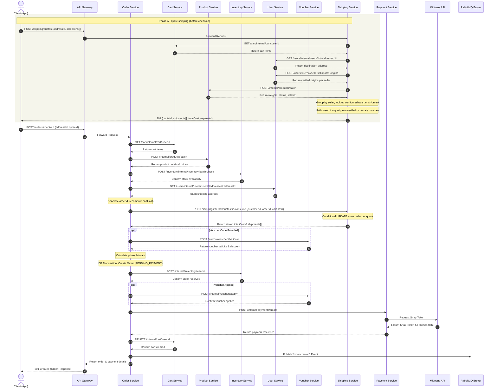

# Checkout Orchestration Flow

This document describes the end-to-end checkout orchestration process in NexaCommerce.

## 1. Shipping is quoted before checkout begins

Checkout does not calculate shipping. The customer obtains a **server-issued quote** first, and
checkout resolves the price from that stored quote. The browser never states what shipping costs.

Fulfillment is **per-seller origin with split shipment**: a cart containing items from three sellers
produces three shipments and three fees, summed into one total. Tariffs come from the internal
verified `shipping_rates` table; when no configured row covers a route, service, and weight, the
quote fails closed rather than inventing a price.

### Quote request

1. The customer picks a courier and service **for each seller** in the cart.
2. The client calls `POST /shipping/quotes` with `addressId` and one `selections` entry per seller.
3. Shipping Service loads the authenticated cart (Cart Service), the destination address and each
   seller's **verified dispatch origin** (User Service), and product weights and status
   (Product Service).
4. It groups cart lines by seller, sums weight per group, and looks up the configured rate for each
   origin-to-destination route, service, and weight bracket.
5. It stores a `ShippingQuote` and returns an opaque `quoteId`, the per-seller breakdown, the total,
   and an expiry.

A quote is refused, with a reason the customer can act on, when: the cart is empty; a product is
missing, inactive, or has no shipping weight; a cart line has an unusable quantity; **a seller has no
verified dispatch origin**; the destination is incomplete; or no configured rate covers the route.

### What the stored quote guarantees

| Property | Mechanism |
|---|---|
| The browser cannot set a price | Only an opaque id crosses the boundary |
| It expires | `expiresAt`, 30 minutes |
| It belongs to one customer | Another customer's quote returns the same "not found" as a missing one |
| It still describes this cart | SHA-256 `cartHash` over cart lines plus destination, recomputed at checkout |
| It prices one order only | Conditional UPDATE plus a partial unique index on `consumedBy` |
| A retry is safe | Re-consuming with the same `orderId` returns the same quote |

## 2. Step-by-Step Checkout Flow

Order Service coordinates a SAGA-like transaction:

1. **Client Request:** `POST /orders/checkout` with `shippingAddressId`, `shippingQuoteId`, and
   optionally `voucherCode` and `notes`. The schema is strict: a request carrying `shippingCost`,
   `courierName`, or `courierService` is rejected with `400`, not silently accepted.
2. **Fetch Active Cart:** Cart Service (`GET /cart/internal/cart/:userId`). An empty cart terminates
   with `400` before anything else happens.
3. **Fetch Product Metadata:** Product Service (`POST /internal/products/batch`) for prices, weights,
   categories, and seller IDs. A product missing from the catalog or not `ACTIVE` aborts checkout.
4. **Check Inventory Levels:** Inventory Service (`POST /inventory/internal/inventory/batch-check`).
5. **Fetch Recipient Address:** User Service (`GET /users/internal/users/:id/addresses/:id`).
6. **Fetch Customer:** Auth Service (`GET /auth/internal/users/:id`).
7. **Claim the Shipping Quote:** Order Service generates the order id, recomputes the cart hash, and
   calls Shipping Service (`POST /shipping/internal/quotes/:id/consume`) with the customer id, the
   order id, and the hash. The response's `totalCost` is the **only** shipping figure used.
   - The order id is generated here, before the order row exists, so the quote is claimed before any
     dependent state. A quote therefore can never price two orders.
   - The quote is refused if it is expired, already consumed, owned by someone else, or if the cart
     or destination changed after it was issued.
   - If a later step fails, the quote stays consumed and the customer requests a new one. That costs
     a round trip; it cannot cause a double charge.
8. **Validate Voucher (Optional):** Voucher Service
   (`POST /vouchers/internal/vouchers/validate`), which sources line data from the server cart rather
   than the request.
9. **Calculate Prices:** `grandTotal = subtotal - discount + quote.totalCost`.
10. **Database Transaction (Order Creation):** Creates the `Order` (status `PENDING_PAYMENT`) with the
    generated id, its `OrderItem` records, `shippingQuoteId`, and `shipmentBreakdown` — the
    authoritative per-seller split. `courierName`/`courierService` hold the first shipment only, for
    existing single-courier reads.
11. **Reserve Inventory:** Inventory Service (`POST /inventory/reserve`). Failure releases whatever
    was reserved and cancels the order.
12. **Lock Voucher Usage:** Voucher Service (`POST /vouchers/internal/vouchers/apply`). Failure
    releases stock and cancels the order.
13. **Generate Payment Token:** Payment Service (`POST /payments/internal/payments/create`). Failure
    releases stock and voucher and cancels the order.
14. **Clear Cart & Publish Event:** Clears the cart, publishes `OrderCreated` to RabbitMQ, and returns
    the order and payment details.

> `OrderCreated` is still published directly rather than through the transactional outbox. Its
> finalization boundary is an open Phase 3 item; see `docs/phase-3-reliability.md`.

## 3. Sequence Diagram

---

## 4. Rollback (Compensating Transactions) Strategy

Because the checkout process spans multiple physical microservices, if any step fails during the checkout sequence, the Order Service initiates a series of compensating transactions (rollback) to ensure data consistency:

| Failure Point | Compensating Action | Coordinator |
|---|---|---|
| **Inventory Reservation fails** | Release any reserved stock for this order; cancel Order database record. | Order Service |
| **Voucher Application fails** | Call `POST /internal/inventory/release` to revert reserved stock; cancel Order. | Order Service |
| **Payment Token Generation fails** | Revert reserved stock; release voucher usage; set Order database record status to `CANCELLED`. | Order Service |
| **Timeout / Connection loss** | SAGA orchestrator tracks the transaction status. An auto-cancellation daemon scans for unpaid orders and automatically triggers stock release and voucher release. | Order Service / Cron Daemon |

---

## 5. Price Calculation Formula

The final checkout totals are calculated as follows:

$$TotalOriginalItemsPrice = \sum_{i=1}^{n} (OriginalPrice_i \times Quantity_i)$$

$$TotalDiscount = \begin{cases} 
VoucherValue & \text{if Fixed Amount} \\
\min\left(TotalOriginalItemsPrice \times \frac{VoucherValue}{100}, MaxDiscount\right) & \text{if Percentage}
\end{cases}$$

$$GrandTotal = TotalOriginalItemsPrice - TotalDiscount + TotalShippingCost$$

$TotalShippingCost$ is the sum of the per-seller shipment costs recorded on the consumed
`ShippingQuote`. It is read from the stored quote, never from the request body and never recomputed
during checkout.
