# Database Entity Relationship Diagrams (ERD)

This document contains Mermaid diagrams for all PostgreSQL database schemas in NexaCommerce.

## 1. Auth Schema (`auth` namespace)

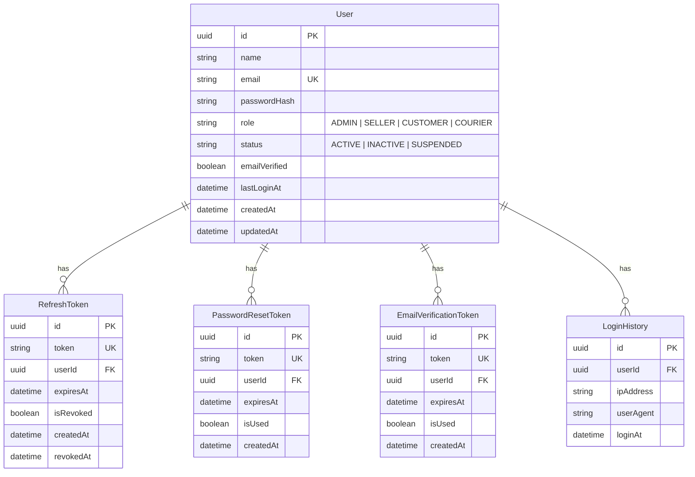

---

## 2. Users Schema (`users` namespace)

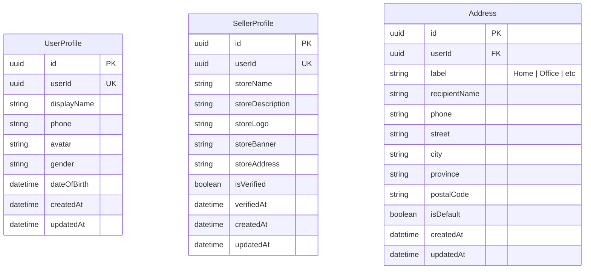

---

## 3. Products Schema (`products` namespace)

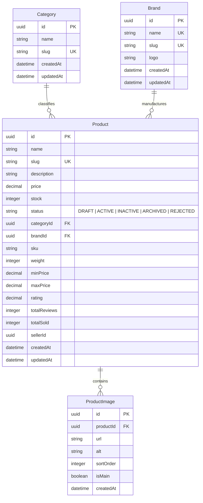

---

## 4. Inventory Schema (`inventory` namespace)

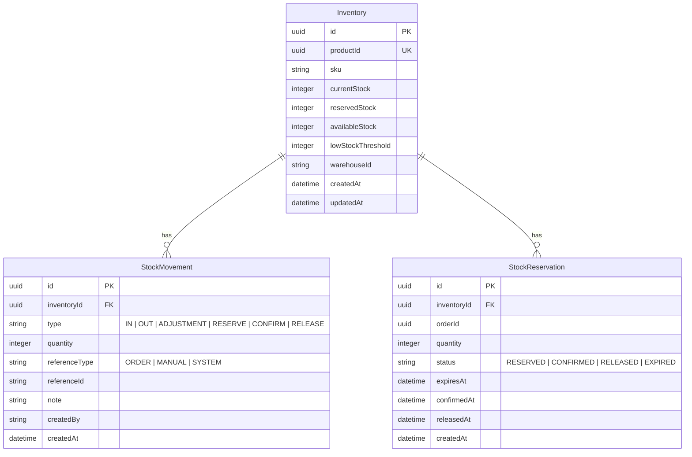

---

## 5. Orders Schema (`orders` namespace)

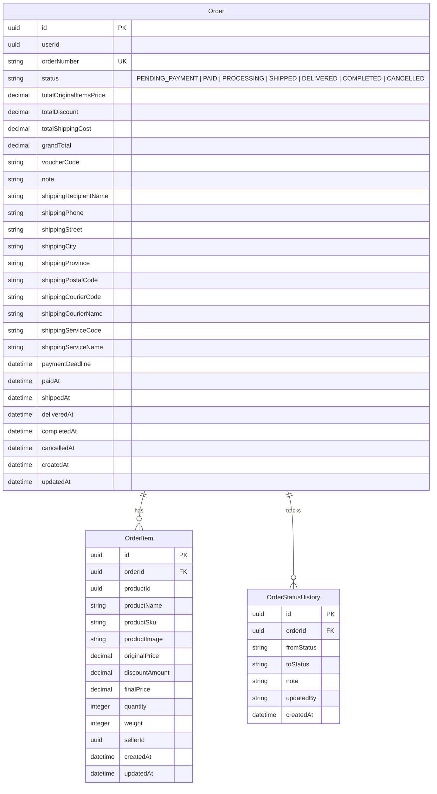

---

## 6. Payments Schema (`payments` namespace)

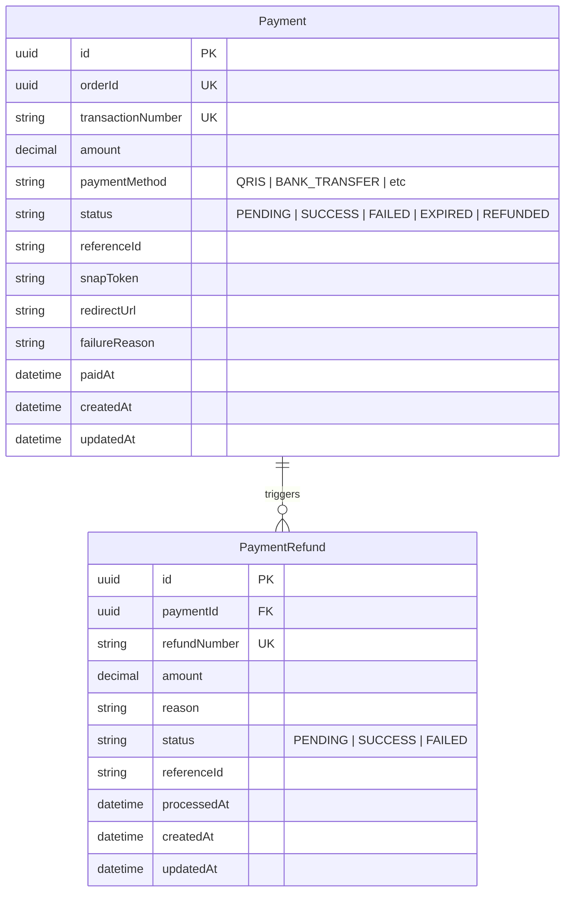

---

## 7. Vouchers Schema (`vouchers` namespace)

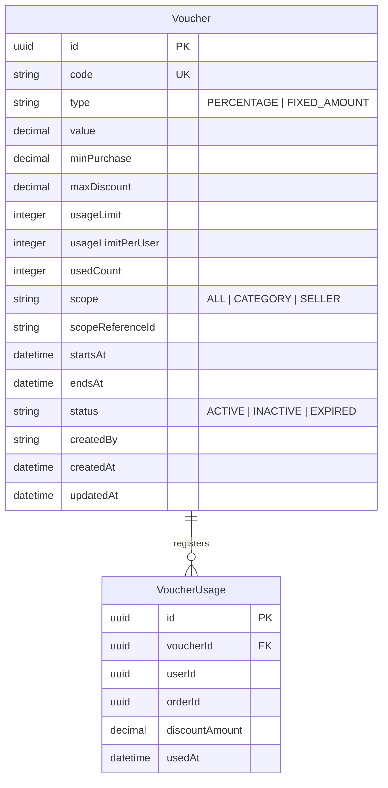

---

## 8. Shipping Schema (`shipping` namespace)

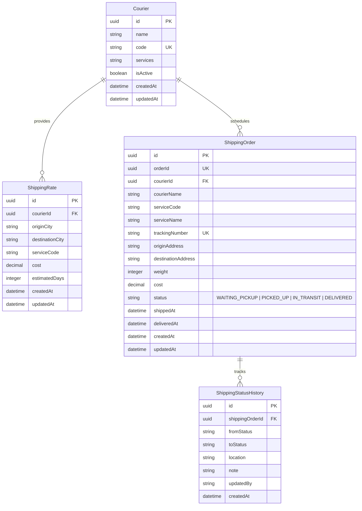

---

## 9. Reviews Schema (`reviews` namespace)

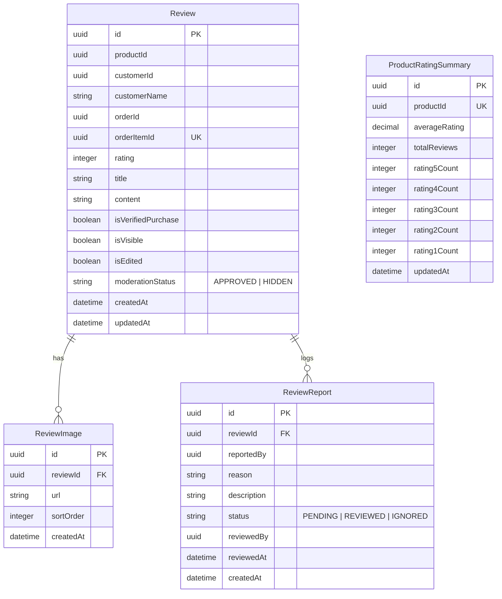

---

## 10. Notifications Schema (`notifications` namespace)

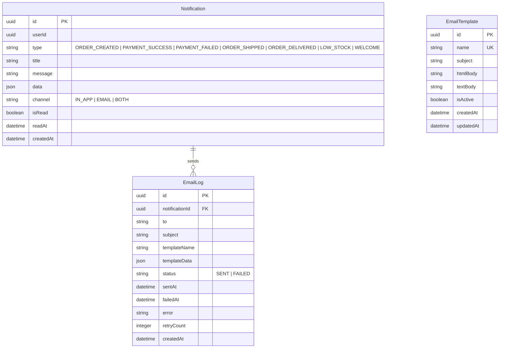

---

## 11. Analytics Schema (`analytics` namespace)

```mermaid
erDiagram
    DailySalesReport {
        uuid id PK
        datetime date UK
        integer totalOrders
        integer totalCompletedOrders
        integer totalCancelledOrders
        decimal totalRevenue
        integer totalItemsSold
        decimal averageOrderValue
        datetime createdAt
        datetime updatedAt
    }
    
    MonthlySalesReport {
        uuid id PK
        integer year
        integer month
        integer totalOrders
        integer totalCompletedOrders
        integer totalCancelledOrders
        decimal totalRevenue
        integer totalItemsSold
        decimal averageOrderValue
        integer newCustomers
        integer newSellers
        datetime createdAt
        datetime updatedAt
    }
    
    ProductSalesReport {
        uuid id PK
        uuid productId
        string productName
        uuid sellerId
        string sellerName
        uuid categoryId
        string categoryName
        integer totalUnitsSold
        decimal totalRevenue
        integer totalOrders
        float averageRating
        string periodType "DAILY | MONTHLY | ALL_TIME"
        datetime periodDate
        datetime createdAt
        datetime updatedAt
    }
    
    SellerPerformanceReport {
        uuid id PK
        uuid sellerId
        string sellerName
        integer totalProducts
        integer totalOrders
        decimal totalRevenue
        integer totalItemsSold
        integer totalCancelled
        float averageRating
        integer totalReviews
        float cancellationRate
        string periodType "MONTHLY | ALL_TIME"
        datetime periodDate
        datetime createdAt
        datetime updatedAt
    }
    
    PaymentReport {
        uuid id PK
        datetime date UK
        integer totalTransactions
        integer successCount
        integer failedCount
        integer expiredCount
        float successRate
        decimal totalAmount
        decimal averageAmount
        datetime createdAt
        datetime updatedAt
    }
    
    CategoryPerformanceReport {
        uuid id PK
        uuid categoryId
        string categoryName
        integer totalProducts
        integer totalOrders
        decimal totalRevenue
        integer totalUnitsSold
        string periodType "MONTHLY | ALL_TIME"
        datetime periodDate
        datetime createdAt
        datetime updatedAt
    }
    
    AnalyticsEvent {
        uuid id PK
        string eventName
        json eventData
        datetime processedAt
        boolean isProcessed
        datetime createdAt
    }
```
