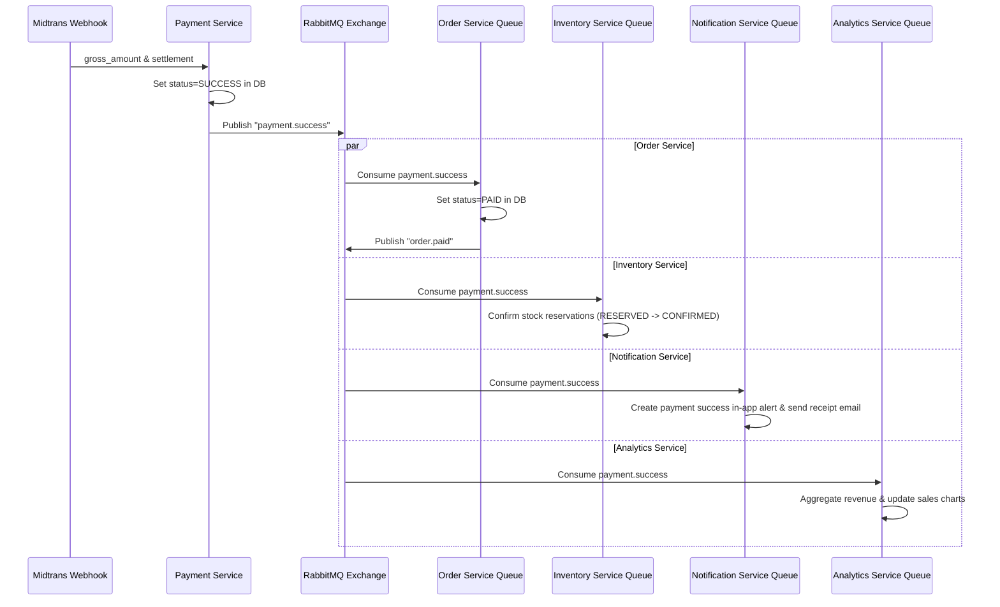

# RabbitMQ Workflow and Kafka Business-Fact Flow

This document describes the message broker architecture, exchange structure, event list, and consumer schemas of NexaCommerce.

## 1. Broker Topology Configuration

All asynchronous events flow through a single **RabbitMQ Exchange**:
- **Exchange Name:** `nexacommerce.events`
- **Exchange Type:** `topic`

Services bind distinct queues to this exchange using specific routing keys:

```
                          ┌──────────────────────────┐
                          │    nexacommerce.events   │ (Exchange: Topic)
                          └────────────┬─────────────┘
                                       │
         ┌─────────────────────────────┼─────────────────────────────┐
         │ routing: order.created      │ routing: payment.success    │ routing: review.created
 ┌───────▼──────────────────────┐ ┌────▼────────────────────────┐ ┌───▼────────────────────────┐
 │   order-service.order-paid   │ │  inventory-service.payment  │ │product-service.review-event│
 └──────────────────────────────┘ └─────────────────────────────┘ └────────────────────────────┘
```

---

## 2. Event Catalog Mapping

| Event Name | Routing Key | Publisher | Consumers | Trigger | Payload | Action |
|---|---|---|---|---|---|---|
| `OrderCreated` | `order.created` | Order Service | Cart, Notification | Checkout successful | `{ orderId, userId, items: [{ productId, qty }] }` | Clears cart; sends in-app/email welcome/order creation alerts. |
| `OrderPaid` | `order.paid` | Order Service | Shipping, Notification | Payment webhook triggers settlement | `{ orderId, userId, amount }` | Instantiates `ShippingOrder` (status: `WAITING_PICKUP`). |
| `PaymentSuccess` | `payment.success` | Payment Service | Order, Inventory, Notification, Analytics | Webhook triggers successful status | `{ orderId, transactionId, amount }` | Marks order as `PAID`; confirms stock reservation; records payment metrics. |
| `PaymentFailed` | `payment.failed` | Payment Service | Order, Inventory, Notification | Webhook triggers deny/cancel/failure | `{ orderId, reason }` | Marks order as `CANCELLED`; releases stock reservations; sends alerts. |
| `OrderShipped` | `order.shipped` | Shipping Service | Order, Notification | Courier picks up items | `{ orderId, trackingNumber, courierCode }` | Updates order to `SHIPPED`; updates tracking logs. |
| `OrderDelivered` | `order.delivered` | Shipping Service | Order, Notification | Courier delivers items | `{ orderId, deliveredAt }` | Updates order to `DELIVERED`; sends arrival alerts. |
| `OrderCompleted` | `order.completed` | Order Service | Analytics, Notification | Customer accepts items, or auto-complete cron trigger (7 days) | `{ orderId, completedAt, total }` | Builds sales metrics; enables review eligibility for products. |
| `ReviewCreated` | `review.created` | Review Service | Product, Analytics, Notification | Customer writes a review | `{ reviewId, productId, rating }` | Recalculates average rating and syncs to Product database. |
| `LowStockDetected`| `stock.low_detected` | Inventory Service | Notification | Stock falls below threshold | `{ productId, currentStock }` | Sends alert notification to the Seller. |
| All replayable facts | matching routing key | Domain outbox via RabbitMQ | Event Stream Service | RabbitMQ confirms the domain event | stable event envelope | Publishes a keyed schema-v1 record to the configured Kafka domain topic. |

---

## 3. Webhook Payment Success Event Cascade



---

## 4. Error Handling & Dead Letter Queue (DLQ) Plan

To prevent transient failures from becoming tight redelivery loops:
1. **Confirmed delayed retry:** Consumers republish failures to `nexacommerce.events.retry`; a per-route queue waits 5 seconds before dead-lettering the delivery back to the main exchange. The default retry budget is 5 attempts and can be overridden per consumer.
2. **Per-consumer DLQ:** Exhausted or malformed messages are broker-confirmed into `<consumer-queue>.dead` through `nexacommerce.events.dead`. The original delivery is acknowledged only after the retry/DLQ copy is confirmed.
3. **Last-resort redelivery:** If RabbitMQ cannot confirm the retry/DLQ copy, the consumer nacks the original with `requeue=true` so the only copy is not lost.
4. **Idempotency:** Durable consumers must claim `eventId` before side effects and treat an already-completed claim as a duplicate.

---

## 5. Kafka replay boundary

RabbitMQ remains responsible for operational delivery. The durable `event-stream-service.business-facts` queue receives a copy of replayable facts, and the bridge only acknowledges each RabbitMQ message after Kafka acknowledges the corresponding keyed record. Kafka consumers build projections; they must not send workflow commands back into checkout/payment/inventory state during replay. See `docs/phase-4-kafka-streaming.md` for topic, key, retention, schema, consumer-group, and replay rules.
