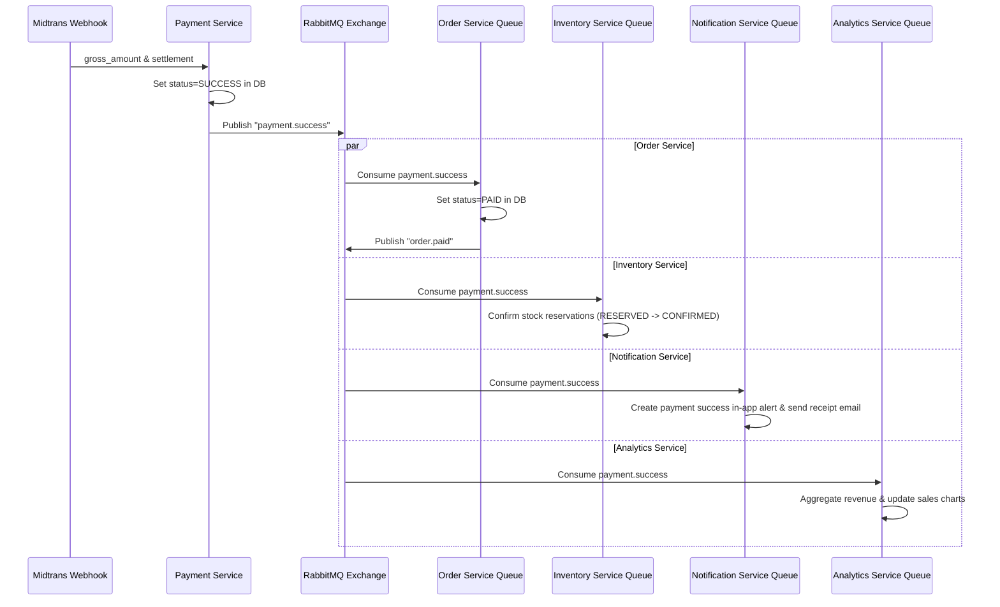

# RabbitMQ Event-Driven Flow Topology

This document describes the message broker architecture, exchange structure, event list, and consumer schemas of NexaCommerce.

## 1. Broker Topology Configuration

All asynchronous events flow through a single **RabbitMQ Exchange**:
- **Exchange Name:** `nexacommerce.events`
- **Exchange Type:** `topic`

Services bind distinct queues to this exchange using specific routing keys:

```
                          ┌──────────────────────────┐
                          │    nexacommerce.events   │ (Exchange: Topic)
                          └────────────┬─────────────┘
                                       │
         ┌─────────────────────────────┼─────────────────────────────┐
         │ routing: order.created      │ routing: payment.success    │ routing: review.created
 ┌───────▼──────────────────────┐ ┌────▼────────────────────────┐ ┌───▼────────────────────────┐
 │   order-service.order-paid   │ │  inventory-service.payment  │ │product-service.review-event│
 └──────────────────────────────┘ └─────────────────────────────┘ └────────────────────────────┘
```

---

## 2. Event Catalog Mapping

| Event Name | Routing Key | Publisher | Consumers | Trigger | Payload | Action |
|---|---|---|---|---|---|---|
| `OrderCreated` | `order.created` | Order Service | Cart, Notification | Checkout successful | `{ orderId, userId, items: [{ productId, qty }] }` | Clears cart; sends in-app/email welcome/order creation alerts. |
| `OrderPaid` | `order.paid` | Order Service | Shipping, Notification | Payment webhook triggers settlement | `{ orderId, userId, amount }` | Instantiates `ShippingOrder` (status: `WAITING_PICKUP`). |
| `PaymentSuccess` | `payment.success` | Payment Service | Order, Inventory, Notification, Analytics | Webhook triggers successful status | `{ orderId, transactionId, amount }` | Marks order as `PAID`; confirms stock reservation; records payment metrics. |
| `PaymentFailed` | `payment.failed` | Payment Service | Order, Inventory, Notification | Webhook triggers deny/cancel/failure | `{ orderId, reason }` | Marks order as `CANCELLED`; releases stock reservations; sends alerts. |
| `OrderShipped` | `order.shipped` | Shipping Service | Order, Notification | Courier picks up items | `{ orderId, trackingNumber, courierCode }` | Updates order to `SHIPPED`; updates tracking logs. |
| `OrderDelivered` | `order.delivered` | Shipping Service | Order, Notification | Courier delivers items | `{ orderId, deliveredAt }` | Updates order to `DELIVERED`; sends arrival alerts. |
| `OrderCompleted` | `order.completed` | Order Service | Analytics, Notification | Customer accepts items, or auto-complete cron trigger (7 days) | `{ orderId, completedAt, total }` | Builds sales metrics; enables review eligibility for products. |
| `ReviewCreated` | `review.created` | Review Service | Product, Analytics, Notification | Customer writes a review | `{ reviewId, productId, rating }` | Recalculates average rating and syncs to Product database. |
| `LowStockDetected`| `low_stock` | Inventory Service | Notification | Stock falls below threshold | `{ productId, currentStock }` | Sends alert notification to the Seller. |

---

## 3. Webhook Payment Success Event Cascade



---

## 4. Error Handling & Dead Letter Queue (DLQ) Plan

To ensure no events are lost due to transient errors (e.g., database timeout or network drop):
1. **Compensating Retry:** Consumers catch runtime errors and reject the message with `requeue=true` up to 3 times (with incremental delays).
2. **DLQ Routing:** If processing fails after 3 attempts, the message is routed to `nexacommerce.deadletter` exchange and stored in a DLQ queue (`deadletter.queue`) for manual audit.
3. **Idempotency Check:** Every consumer verifies transaction IDs against processed lists before executing business actions.
