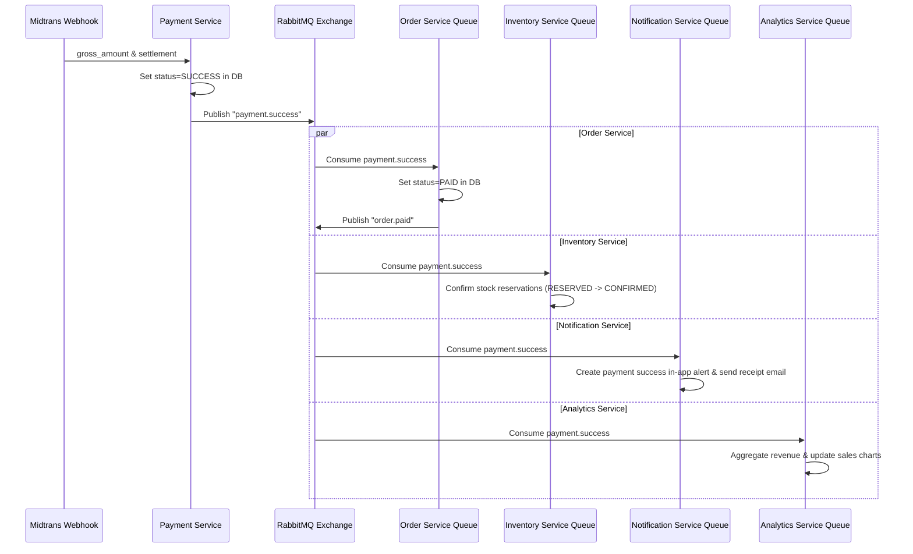

# RabbitMQ Workflow and Kafka Business-Fact Flow

This document describes the message broker architecture, exchange structure, event list, and consumer schemas of NexaCommerce.

## 1. Broker Topology Configuration

All asynchronous events flow through a single **RabbitMQ Exchange**:
- **Exchange Name:** `nexacommerce.events`
- **Exchange Type:** `topic`

Services bind distinct queues to this exchange using specific routing keys:

```
                          ┌──────────────────────────┐
                          │    nexacommerce.events   │ (Exchange: Topic)
                          └────────────┬─────────────┘
                                       │
         ┌─────────────────────────────┼─────────────────────────────┐
         │ routing: order.created      │ routing: payment.success    │ routing: review.created
 ┌───────▼──────────────────────┐ ┌────▼────────────────────────┐ ┌───▼────────────────────────┐
 │   order-service.order-paid   │ │  inventory-service.payment  │ │product-service.review-event│
 └──────────────────────────────┘ └─────────────────────────────┘ └────────────────────────────┘
```

---

## 2. Event Catalog Mapping

| Event Name | Routing Key | Publisher | Consumers | Trigger | Payload | Action |
|---|---|---|---|---|---|---|
| `OrderCreated` | `order.created` | Order Service (outbox, id `order-created:<orderId>`) | Notification, Analytics | Checkout saga finalized | `{ orderId, userId, items: [{ productId, qty }] }` | Clears cart; sends in-app/email welcome/order creation alerts. |
| `OrderCancelled` | `order.cancelled` | Order Service | Inventory, Analytics | Customer/admin cancel, payment failure/expiry, checkout compensation, stalled-checkout recovery | `{ orderId, customerId, reason, cancelledAt, checkoutFinalized? }` | Inventory releases reservations. `checkoutFinalized: false` marks a checkout that never produced `OrderCreated`; order-count projections skip it. |
| `OrderPaid` | `order.paid` | Order Service | Shipping, Notification | Payment webhook triggers settlement | `{ orderId, userId, amount }` | Instantiates `ShippingOrder` (status: `WAITING_PICKUP`). |
| `PaymentSuccess` | `payment.success` | Payment Service | Order, Inventory, Notification, Analytics | Webhook triggers successful status | `{ orderId, transactionId, amount }` | Marks order as `PAID`; confirms stock reservation; records payment metrics. |
| `PaymentFailed` | `payment.failed` | Payment Service | Order, Inventory, Notification | Webhook triggers deny/cancel/failure | `{ orderId, reason }` | Marks order as `CANCELLED`; releases stock reservations; sends alerts. |
| `OrderShipped` | `order.shipped` | Shipping Service | Order, Notification | Courier picks up items | `{ orderId, trackingNumber, courierCode }` | Updates order to `SHIPPED`; updates tracking logs. |
| `OrderDelivered` | `order.delivered` | Shipping Service | Order, Notification | Courier delivers items | `{ orderId, deliveredAt }` | Updates order to `DELIVERED`; sends arrival alerts. |
| `OrderCompleted` | `order.completed` | Order Service | Analytics, Notification | Customer accepts items, or auto-complete cron trigger (7 days) | `{ orderId, completedAt, total }` | Builds sales metrics; enables review eligibility for products. |
| `ReviewCreated` | `review.created` | Review Service | Product, Analytics, Notification | Customer writes a review | `{ reviewId, productId, rating }` | Recalculates average rating and syncs to Product database. |
| `LowStockDetected`| `stock.low_detected` | Inventory Service | Notification | Stock falls below threshold | `{ productId, currentStock }` | Sends alert notification to the Seller. |
| All replayable facts | matching routing key | Domain outbox via RabbitMQ | Event Stream Service | RabbitMQ confirms the domain event | stable event envelope | Publishes a keyed schema-v1 record to the configured Kafka domain topic. |

---

## 3. Webhook Payment Success Event Cascade



---

## 4. Error Handling & Dead Letter Queue (DLQ) Plan

To prevent transient failures from becoming tight redelivery loops:
0. **Poison messages skip retry:** unparseable JSON, a missing `eventId`/`eventName`, or a handler
   throwing `NonRetryableEventError` is dead-lettered on the first delivery.
1. **Confirmed delayed retry:** Consumers republish failures to `nexacommerce.events.retry`; a per-route queue waits 5 seconds before dead-lettering the delivery back to the main exchange. The default retry budget is 5 attempts and can be overridden per consumer.
2. **Per-consumer DLQ:** Exhausted or malformed messages are broker-confirmed into `<consumer-queue>.dead` through `nexacommerce.events.dead`. The original delivery is acknowledged only after the retry/DLQ copy is confirmed.
3. **Last-resort redelivery:** If RabbitMQ cannot confirm the retry/DLQ copy, the consumer nacks the original with `requeue=true` so the only copy is not lost. If the failed publish already closed the channel, the broker requeues the unacknowledged original itself; the nack is guarded so it cannot surface as an unhandled rejection.
4. **Idempotency:** Durable consumers must claim `eventId` before side effects and treat an already-completed claim as a duplicate.
5. **Reconnection:** consumers are attached through `createResilientConsumer` or a service dispatcher loop that re-declares topology and re-registers consumers after any connection loss. Unacknowledged deliveries of the lost channel return to the queue.

All of the above is exercised against a live broker in `packages/common/tests/live/rabbitmq.live.test.ts`
and `apps/order-service/tests/live/order.rabbitmq.live.test.ts`; see `docs/phase-3-reliability.md`.

---

## 5. Kafka replay boundary

RabbitMQ remains responsible for operational delivery. The durable `event-stream-service.business-facts` queue receives a copy of replayable facts, and the bridge only acknowledges each RabbitMQ message after Kafka acknowledges the corresponding keyed record. The bridge is **at-least-once**, not exactly-once: a crash between the Kafka acknowledgement and the RabbitMQ ack republishes the same `eventId`. It keeps no inbox on purpose — its side effect lives in Kafka, which cannot share a PostgreSQL transaction — so deduplication belongs to Kafka consumers (the Analytics projection's inbox). Kafka consumers build projections; they must not send workflow commands back into checkout/payment/inventory state during replay. See `docs/phase-4-kafka-streaming.md` for topic, key, retention, schema, consumer-group, and replay rules.

## 6. Consumer-side inbox

Consumers whose side effect could be partial or repeated apply an event through the
database-backed inbox in `packages/common/src/inbox.ts` (Order payment and shipping consumers,
Shipping `OrderPaid`, Analytics, Notification). Inventory relies on per-reservation conditional
claims inside the same transaction, and Product writes an absolute rating value re-read on each
delivery; both are idempotent without an inbox. The full per-consumer table is in
`docs/phase-3-reliability.md`. The claim, the business mutation, and the record marking the event
consumed all commit in one transaction:

```
runInTransaction(tx => {
  claim(tx, {eventId, consumer})   -> DUPLICATE ? skip
  handler(tx)                      -> the state change
  markProcessed(tx, {eventId, consumer})
})
```

The deduplication key is `(event_id, consumer)`, not `event_id` alone. One event may therefore be
applied once *per consumer*, which is what allows the RabbitMQ consumer and the Kafka projection to
each process the same domain fact into their own tables without either skipping it as a duplicate of
the other.

Because the claim shares the transaction, a failed attempt rolls back its own claim; there is no
lease to expire and no stuck claim to recover. A worker that loses a concurrent race hits the unique
constraint on the inbox key and reads that as a duplicate delivery rather than an error; a unique
violation from any other table is a real failure and is retried. Taking over a previously FAILED
row is conditional on it not being PROCESSED, so two racing redeliveries cannot both apply it.

Two consequences that callers rely on:

- **Network calls happen before the transaction opens.** Both Analytics and Notification resolve
  their enrichment (catalog, review summary, recipient) first, so a projection never holds row locks
  while waiting on another service.
- **A side effect that cannot be rolled back gets a safety copy inside the transaction.** Outbound
  email is not sent during consumption; a job row is written to `email_logs` in the same transaction
  as the notification, and a separate dispatcher delivers it with bounded retries. Delivery is
  at-least-once by construction, which is the correct direction for transactional mail.

## 7. Kafka projection boundary

The Analytics Kafka projection reads `nexacommerce.orders.v1` and `nexacommerce.payments.v1` and
writes only `daily_sales_projections` and `kafka_projection_progress`.

- `autoCommit` is off. A failed projection throws before `commitOffsets`, so an offset advances only
  after the projection transaction has committed.
- `partitionsConsumedConcurrently: 1` preserves per-partition ordering.
- Only `schemaVersion` 1 is accepted. A malformed or unsupported record is counted and stepped over
  rather than retried forever, because blocking a partition on one bad record stalls every
  well-formed event behind it.
- The projection never calls RabbitMQ and never mutates order, payment, inventory, or shipping
  state, which is what makes replaying a topic from any offset safe.

`daily_sales_projections` is deliberately separate from the RabbitMQ-fed `daily_sales_report`: the
same fact arrives over both paths, and one shared table would count every order and payment twice.
The cutover sequence is in `docs/phase-4-kafka-streaming.md`.
