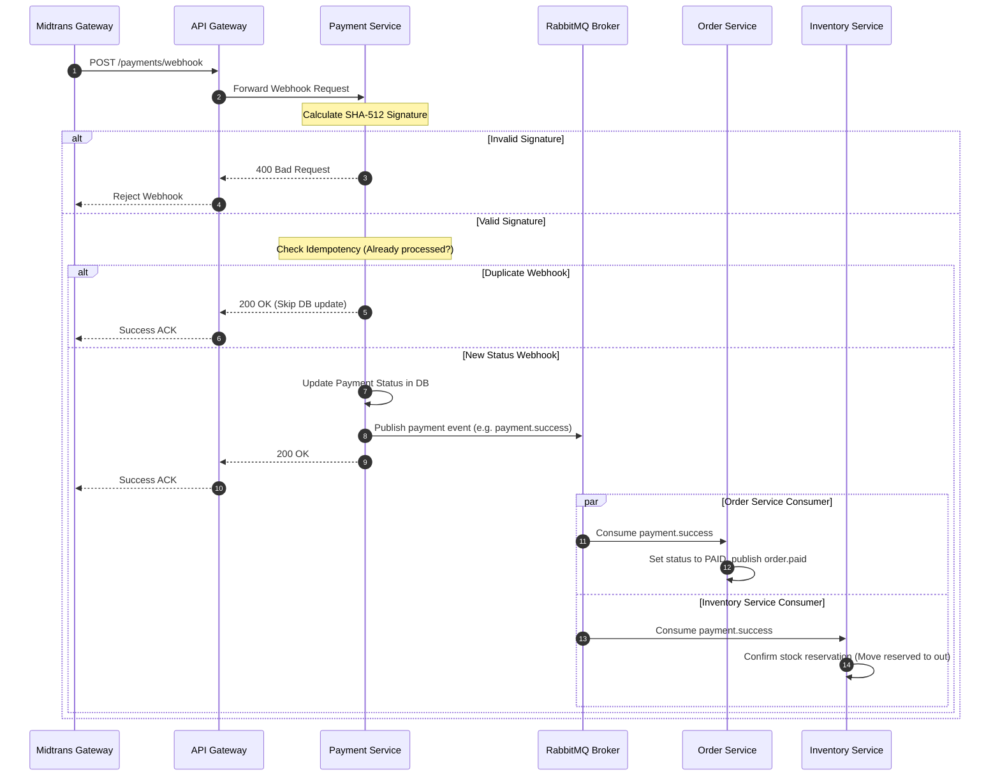

# Payment Webhook Flow

This document details the Midtrans payment webhook notification flow, signature verification formulas, idempotency mechanism, and event cascades.

## 1. Webhook Notification Process

When a customer pays (or the transaction expires/fails), the payment gateway (Midtrans) sends an HTTP POST notification request directly to the Payment Service endpoint `/payments/webhook`.

1. **Receive Notification:** Payment Service receives the webhook payload containing transaction details.
2. **Signature Verification:** The service generates a SHA-512 signature using the transaction metadata and the secret server key, validating it against the `signature_key` header provided in the payload.
3. **Check Idempotency:** The service checks if the transaction has already been processed using a database unique constraint on `transactionNumber` / status verification.
4. **Determine Status:** The service maps Midtrans status codes to internal statuses:
   - `settlement` / `capture` (accept) -> `SUCCESS`
   - `deny` / `cancel` / `failure` -> `FAILED`
   - `expire` -> `EXPIRED`
5. **Database Update:** The payment status is written to the database.
6. **Publish Event:** The Payment Service publishes the corresponding event to RabbitMQ:
   - Success -> `PaymentSuccess` (`payment.success`)
   - Failure -> `PaymentFailed` (`payment.failed`)
   - Expiration -> `PaymentExpired` (`payment.expired`)
7. **Event Cascade (Downstream Consumptions):**
   - **Order Service:** Listens for payment success to update order status to `PAID` (or `CANCELLED` on expire).
   - **Inventory Service:** Listens for payment success to transition stock reservations from `RESERVED` to `CONFIRMED`.
   - **Notification Service:** Listens to notify the user via push and email logs.
   - **Analytics Service:** Listens to register metrics in daily reports.

---

## 2. Signature Validation Formula

To prevent spoofing attacks, Midtrans mandates that payment webhooks must be verified using a SHA-512 checksum:

$$SignatureKey = \text{SHA512}\left(\text{order\_id} + \text{status\_code} + \text{gross\_amount} + \text{ServerKey}\right)$$

### Example validation code:
```typescript
import crypto from 'crypto';

const computedSignature = crypto
  .createHash('sha512')
  .update(orderId + statusCode + grossAmount + serverKey)
  .digest('hex');

if (computedSignature !== receivedSignature) {
  throw new Error('Invalid signature key');
}
```

---

## 3. Webhook Flow Diagram



---

## 4. Testing Webhook Notifications Locally

You can simulate a Midtrans webhook notification using curl or Postman:

```bash
curl -X POST http://localhost:3000/api/v1/payments/webhook \
  -H "Content-Type: application/json" \
  -d '{
    "order_id": "ORDER-12345",
    "status_code": "200",
    "gross_amount": "1549000.00",
    "transaction_status": "settlement",
    "payment_type": "qris",
    "transaction_id": "midtrans-tx-009988",
    "signature_key": "COMPUTED_SHA512_SIGNATURE_HERE"
  }'
```
