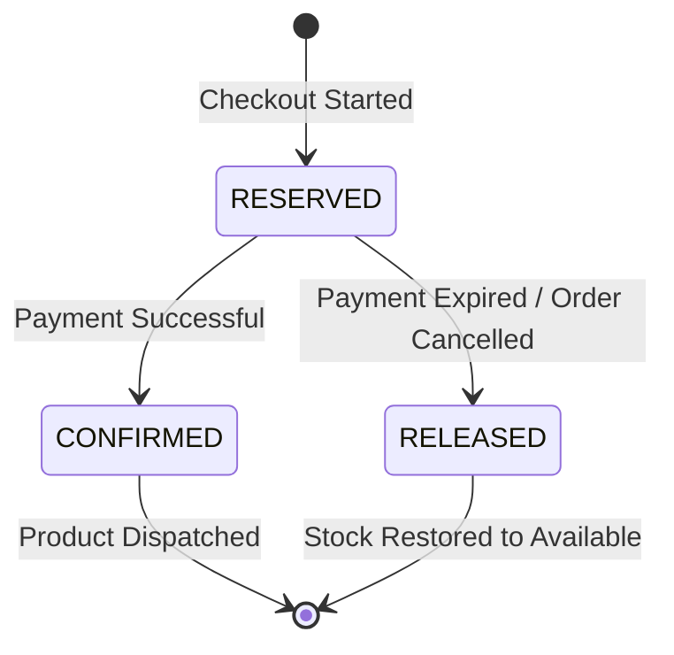

# Stock Reservation Lifecycle

This document describes the inventory stock reservation pattern used in NexaCommerce to prevent overselling and resolve race conditions during concurrent checkouts.

## 1. Stock State Machine

Product inventory stock in NexaCommerce transitions through a three-stage reservation lifecycle:



- **RESERVED:** Stock is allocated for a pending order. `availableStock` decreases, and `reservedStock` increases. The item is locked for the customer for a limited time (typically 1 hour to match the Midtrans Snap payment window).
- **CONFIRMED:** The order is paid successfully. The `reservedStock` decreases, and `currentStock` decreases. The reservation is converted to a permanent sale.
- **RELEASED:** The payment window expires, or the customer cancels the order. The `reservedStock` decreases, and `availableStock` increases, making the product purchasable by other customers.

---

## 2. Inventory Properties Matrix

| Stock Field | Initial State | Reserved State | Confirmed State | Released State |
|---|---|---|---|---|
| `currentStock` | 50 | 50 | **45** (down) | 50 |
| `reservedStock` | 0 | **5** (up) | **0** (down) | **0** (down) |
| `availableStock` | 50 | **45** (down) | 45 | **50** (up) |

---

## 3. Concurrency & Race Condition Handling

To handle high-traffic checkouts (e.g., flash sales), the **Inventory Service** utilizes database transaction boundaries and pessimistic locking:

```typescript
// Example database locking strategy for reserving stock
await prisma.$transaction(async (tx) => {
  const stock = await tx.inventory.findUnique({
    where: { productId },
  });

  if (!stock || stock.availableStock < requestedQuantity) {
    throw new Error('Insufficient stock available');
  }

  // Update quantities
  await tx.inventory.update({
    where: { id: stock.id },
    data: {
      reservedStock: { increment: requestedQuantity },
      availableStock: { decrement: requestedQuantity },
    },
  });
});
```

---

## 4. Auto-Release Daemon

To prevent orphaned reservations (where stock is reserved but never paid for or cancelled), a background cron daemon in the **Inventory Service** scans for expired reservations (`expiresAt < now()`) every 5 minutes:

1. **Scan:** Queries `StockReservation` where status is `RESERVED` and `expiresAt` is in the past.
2. **Release Stock:** For each expired entry, starts a transaction to decrement `reservedStock` and increment `availableStock` by the reserved quantity.
3. **Set Status:** Marks reservation status as `EXPIRED`.
4. **Publish Event:** Publishes `ReservationReleased` to notify the Order Service to cancel the pending order.
